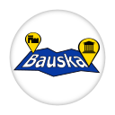
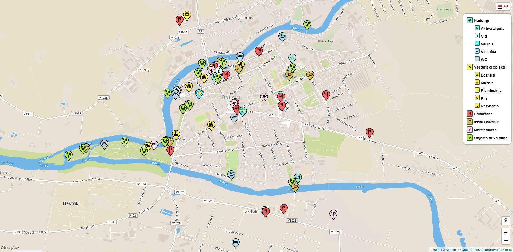
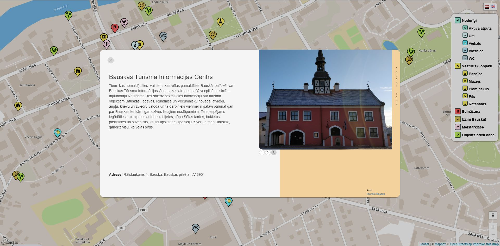

 
# BauskaTour

#### BauskaTour is a university project developed by team EduBauska during "First Year seminar" course in Riga Business School to improve lack of tourism in Bauska

The idea is realised with a web application which displays different tourism attraction points on a map with interesting and useful information about them.

### Main features:
* Map with many different tourism object in Bauska
* Clicking on an object opens a window with a lot of useful information about the object
* Possibility to choose between many different object layers to better locate preferred destinations
* Multilingual support (Latvian & English)
* GPS integration allows users to immediately find their current location in Bauska and navigate around the city much easier
* PWA support - the web application offers possibility to add it to the home screen of your Android and/or iOS device and use it like an ordinary app

### Created, developed and designed by:
* Mārtiņš Ciekurs ([@miefos](https://github.com/miefos))
* Klinta Madara Greiliha
* Paula Jasmane
* Krišjānis Lējējs ([@klejejs](https://github.com/klejejs))
* Roze Melnūdre
* Jevgeņija Šļonska